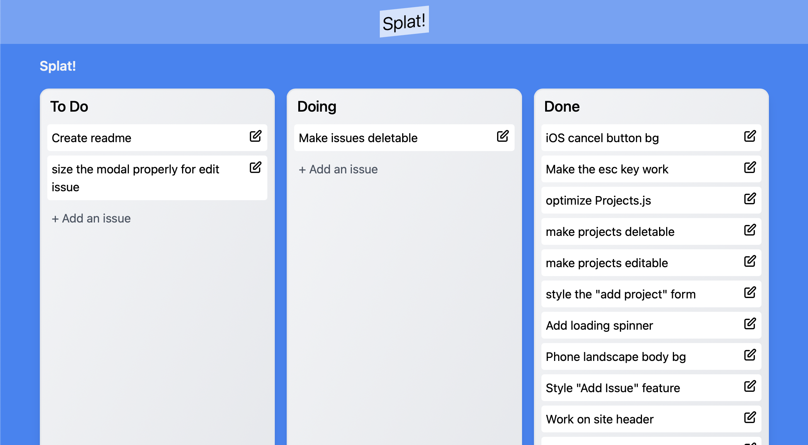
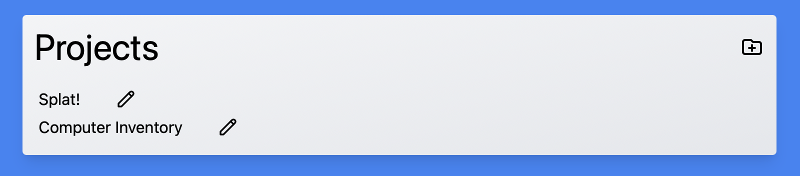
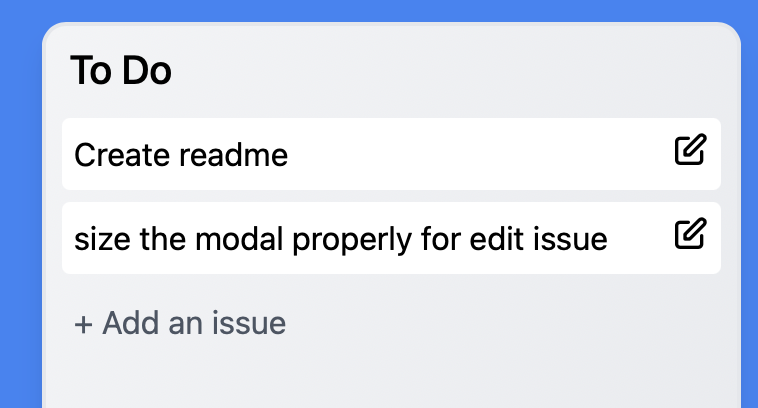
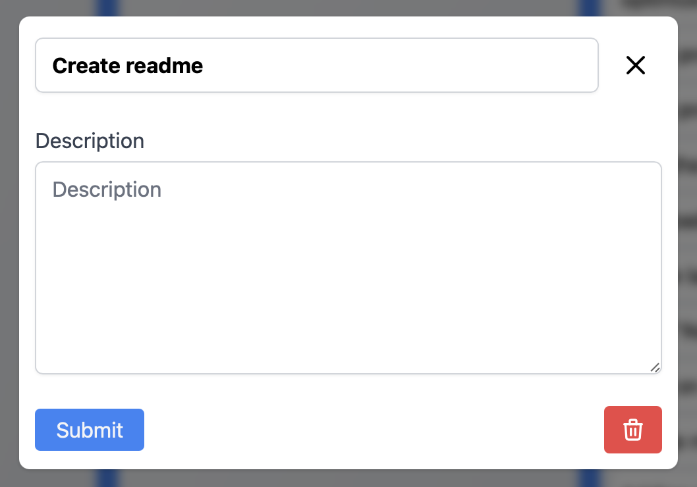

# Splat

## Overview

Splat is a bug-tracker app.  It provides a way to track issues/bugs related to projects and monitor progress as they are addressed.

Deployed at https://splat.lukegraham.us

Splat was built with React, Redux, Tailwind, Mongo, React-Beautiful-DND, Node.js and Express.

## Views

### Projects

Before bugs and issues can be tracked they must be associated with a project.  Create a new project with the + button in the top right of the Projects screen.  Existing Project names can be edited by clicking on their pencil icon.  Clicking on the existing project to work with it's issues

### Project

The project page contains three columns: To Do, Doing and Done.  Issues can be added to each column.  Then the issues can be clicked and dragged around eachother and onto the different columns.

Clicking on an issue's pencil icon loads the Edit popup.

### Issue Popup

From the Issue Popup the issue summary can be edited.  A description can be added.  The issue can also be deleted.

